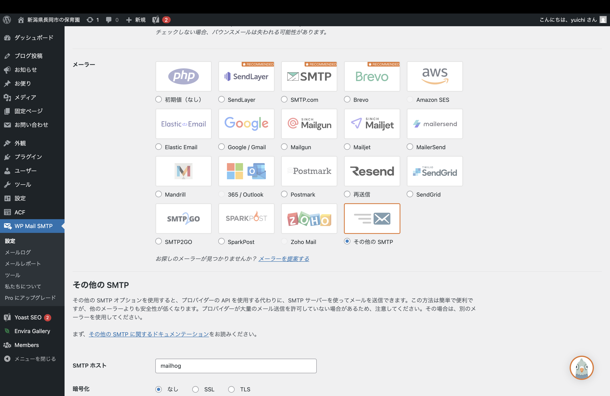
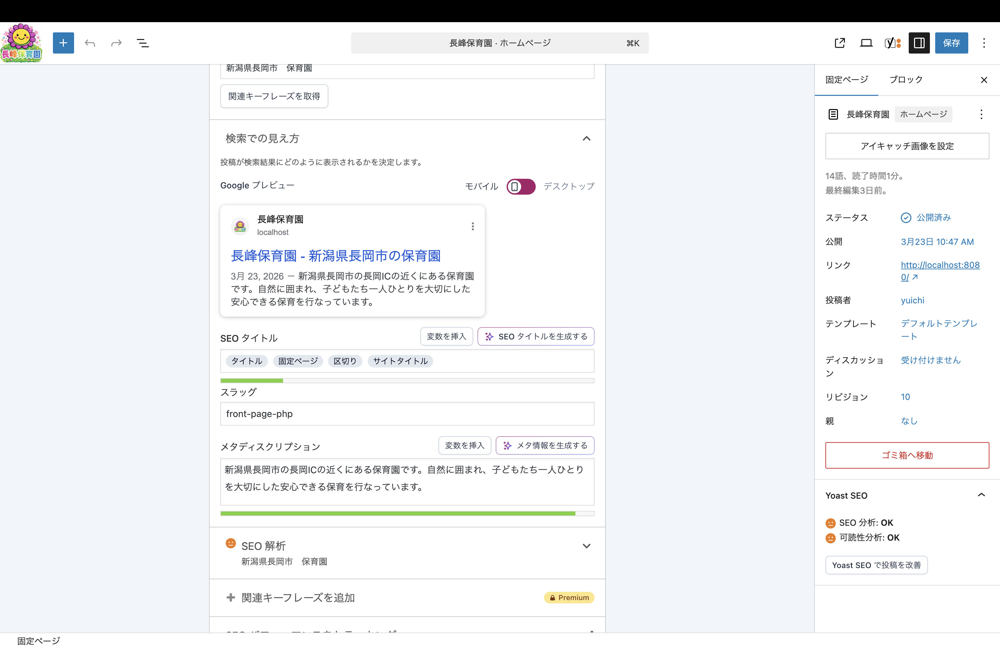

# 長峰保育園ホームページ制作（WordPressテーマ開発 / Docker環境構築）

## 概要

長峰保育園の既存サイトが静的なHTMLで構築されており、
職員による情報更新が困難であるという課題を解決するため、
WordPressを導入しリニューアルを想定して制作しました。

保護者の年齢を20代〜30代と想定し、PC版だけでなく、スマホ版も実装しました。
お知らせとBLOGの一般公開情報と、「行事写真」や「園だより」といった保護者向けに分けた設計をしています。
Docker環境で構築しており、クローン後すぐに動作確認が可能です。

### トップページデモ

サイト全体のスクロール(約5秒）

https://github.com/user-attachments/assets/a3a72319-e5ac-41ee-b82e-6219c4547af1

## 開発経緯

既存の長峰保育園のサイトは、当時の園長の知人に依頼して作成された静的なHTMLサイトでした。

そのため、保育園の職員自身で更新することができず、
情報が長期間更新されていない状態となっており、
保護者にとって有益な情報が十分に提供できていないという課題がありました。

そこで、WordPressを導入し、
職員が管理画面から簡単に情報更新できる仕組みを構築することを目的として本サイトを制作しました。

また、実在する保育園（義母が園長を務める長峰保育園）を題材にすることで、
実務を想定した設計・実装を行いました。

## URL

本アプリはローカル環境で構築しています。

▽ フロント画面  
http://localhost:8080

▽ 管理画面  
http://localhost:8080/wp-admin/

※ローカル環境のため、外部からはアクセスできません。

## 使用技術

- Figma（ワイヤーフレーム・デザイン設計）
- WordPress（テーマ開発）
- PHP
- HTML / CSS / JavaScript
- Yoast SEO
- ACF（カスタムフィールド）

## 主な機能

- カスタム投稿
  - お知らせ(news)
  - お便り(letter)

- 権限設計
  - 園長・管理者（すべて使用可能）
  - 主任（投稿・公開のみ可能）
  - 先生（投稿のみ可能）
  - 保護者(閲覧のみ)

- お便り機能
  - クラス別お便り投稿
  - ログインユーザーのみ閲覧可能

- SEO対策
  - トップページ・お知らせページにSEO設定
  - 在園者向けページにはnoindex設定

## デザイン

 本サイトはFigmaを使用してデザインカンプを作成し、デザインからコーディングまで一貫して作成しました。

 ▽Figmaデザイン
 https://www.figma.com/design/XAAP3PmaYvkjyqDjWBPOCv/%E9%95%B7%E5%B3%B0%E4%BF%9D%E8%82%B2%E5%9C%92%E3%83%9D%E3%83%BC%E3%83%88%E3%83%95%E3%82%A9%E3%83%AA%E3%82%AA%E3%83%87%E3%82%B6%E3%82%A4%E3%83%B3%E3%82%AB%E3%83%B3%E3%83%97?node-id=0-1&t=NzgQ3Py8vXlStybf-1

 ※デザイン作成後、実装段階でUI・レイアウトの調整を行っており、
一部デザインと異なる箇所があります。

## 使用プラグイン

### 1.Contact Form 7

**概要**
 - お問い合わせ、及び出欠・遅刻連絡を実装するために使用

 **導入理由**
 - 今までサイト上から問い合わせができなかったことから導入しました。その中でContact Form 7を選んだのはとにかくシンプルな機能のものを選びました。また、出欠・遅刻連絡も入れたのは電話以外でも連絡できる手段を用意するために導入しました。

 **実装内容**
  - お問い合わせフォーム
  - 出欠・遅刻連絡フォーム（欠席・遅刻など専用）

 **工夫点**
 - フォームを用途ごとに分けることで、入力内容を明確化
 - 出欠連絡では最低限の要件を設けることで必要な情報を明文化できる設計
 - 保護者がスマートフォンからでも簡単に操作できる設計
　
### スクリーンショット


### 2. Advanced Custom Fields
 **概要**
  - 投稿にカスタムフィールドを追加し、情報管理を行うために使用

 **導入理由**
  - お便り情報をPDF形式で管理することで、保護者が印刷しやすい形で閲覧できるようにするために導入しました。

**実装内容**
 - ACFを用いて「お便り」投稿に専用のカスタムフィールドを追加
 - PDFファイルを投稿ごとに管理できるようにし、管理画面から簡単に更新できる構成にしました

**工夫点**
 - お便りはPDFで配布されることを想定し、ボタンひとつで内容が伝わるシンプルなUIに設計
 - 不要なテキストを減らし、保護者が直感的に操作できるようにしました
 - 管理画面では入力項目を最小限に抑え、非エンジニアでも更新しやすい構成にしています

### スクリーンショット


### 3 Admin Menu Editor
 **概要**
  - 管理画面をカスタマイズするものになります

 **導入理由**
  - 非エンジニアでも利用しやすいように、管理画面のメニュー構成を整理し、必要な項目に素早くアクセスできるようにしました

### スクリーンショット
 

 ### 4 Members
  **概要**
  - ユーザー権限の管理

  **導入理由**
  - 在園者向けページの閲覧制限を行うために導入しました。
  - ユーザーごとに権限を分けることで、閲覧できる情報を適切に制御しています。

 **実装内容**
  - 管理側で「園長・管理者」は全ての権限があり、「主任・リーダー」は公開と投稿を可能にし、「先生」と「事務員」は公開のみを可能にしています。
  -保護者は「在園者はこちら」の記事を読むことができます。

 **工夫点**
   - 「在園者はこちら」で在園者のみが閲覧できるページの管理
   - ユーザーごとに権限を分けることで、情報の管理と運用のしやすさを両立
   - シンプルな権限設計にすることで、非エンジニアでも扱いやすい構成にしている

### スクリーンショット


### 5.WP Mail SMTP
 **概要**
  - mailhogによる送信動作確認用のプラグです

**導入理由**
- お問い合わせや欠席・遅刻が実際に送信できているかどうか確認するためにMailhogで確認したいため導入いたしました。

### スクリーンショット



### 6.Envira Gallery - Image Photo Gallery, Albums, Video Gallery, Slideshows & More
 **概要**
 - 行事写真など園児の写真を保護者が確認できるようにしている

 **導入理由**
 - ブログだけではなく、保護者が保育園で楽しめている様子を確認できるために導入しました

 **工夫点**
 - 写真を一覧で見やすく表示することで、スマートフォンでも直感的に閲覧できるように設計

  ### スクリーンショット


### 7.EWWW Image Optimizer
 **概要**
 - 本プラグインは特定のページで使用するのではなく、画像アップロード時に自動で最適化を行うことで、サイト全体の表示速度向上に寄与しています。特に写真を多く使用するギャラリーページにおいて効果を発揮し、スマートフォンでも快適に閲覧できるようにしています。

 **導入背景**
 - 画像の表示速度低下を防ぐために導入しました。

 ### 8.Yoast SEO
 **概要**
 - 検索エンジン最適化（SEO対策）を行うために使用

 **導入背景**
 - 園の情報を必要としている保護者に適切に届くよう、検索エンジンからの流入を意識して導入しました。

 **実装内容**
  - トップページにタイトルとメタディスクリプションの記載

### スクリーンショット


## 環境構築

※本リポジトリはポートフォリオ用のため、ローカル環境での動作となります。

### 起動手順

```bash
git clone https://github.com/yuichihomma/nagamine-hoikuen-site.git
cd nagamine-hoikuen-site
docker compose up -d --build

```

本リポジトリには表示確認用データを含んだDBダンプを同梱しています。
コンテナ起動後、以下のコマンドを実行してください。
## DBインポート手順

まず MySQL コンテナ名を確認してください。

```bash
docker ps

```
その後、以下を実行してください。

```bash
cat sql/wordpress.sql | docker exec -i <mysqlコンテナ名> mysql -u root -prootpass wordpress

```

※ <mysqlコンテナ名> は docker ps で表示される MySQL コンテナ名に置き換えてください。

ブラウザで以下にアクセスしてください。
http://localhost:8080

※初回起動時はコンテナのビルドに時間がかかる場合があります。
※WordPressの初期設定画面が表示される場合があります。

## テストログイン

 在園者向けページはログインが必要です。

 テスト用アカウント（閲覧用）
- ユーザー名：nagamine001
- パスワード：abc123

 ## スクリーンショット

 ### トップページ
 

 ### ブログ
 

 ### 管理画面
 

 ## 工夫した点

 - WordPressおよびFigmaを初めて使用したため、公式ドキュメントや参考サイトをもとに学習しながら実装を行いました。
 - Figmaで画面設計を行い、その構成をもとにWordPressテーマとして再現しました。
 - PC版だけでなく、スマホ版も搭載し、閲覧しやすくしています。
 - 一般の方向けの公開ページと在園者向けの非公開ページを作成することで実務向けにしました。
 - お問い合わせフォームを作成することで電話以外でも問い合わせできるようにしました。

 ## 苦労した点

 - 初めてWordPress特有のテンプレート階層の理解に苦労しましたが、実装を通して構造を理解しました。
 - Figmaを初めて使用し、デザイン設計から実装までの流れを学びました。

 ## 今後の改善

 - UI/UXの向上（JavaScriptを使用したデザイン向上）
 - 行事写真の閲覧制限や在園者のクラスクラス分だけ閲覧できるようなセキュリティ強化。

 ## 制作期間
 - 約3週間

 ## 作者
 本間　雄一
 (ポートフォリオ用に作成)
